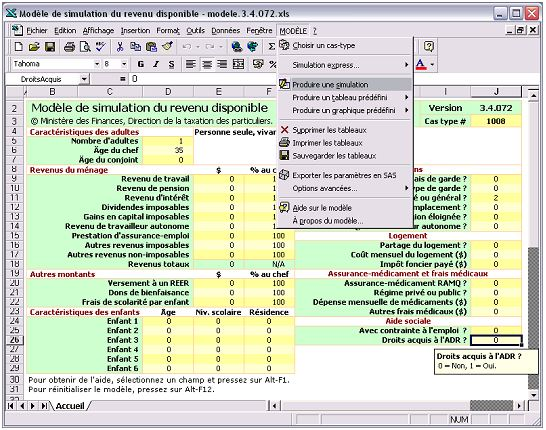
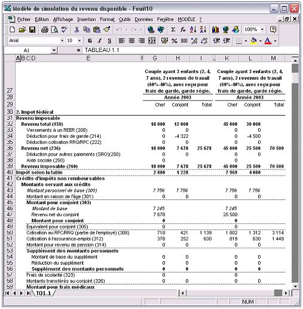
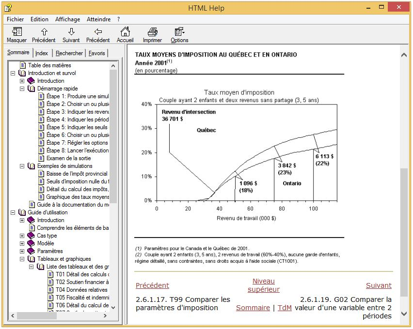
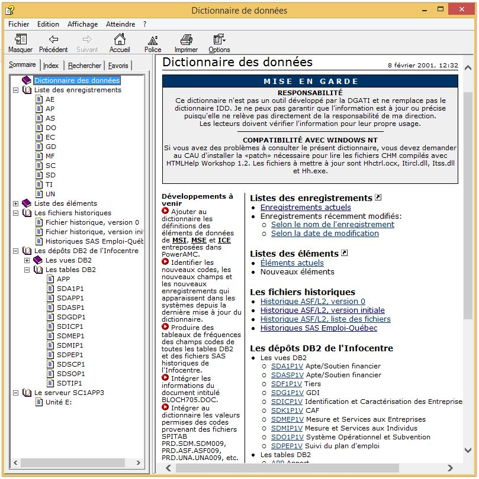
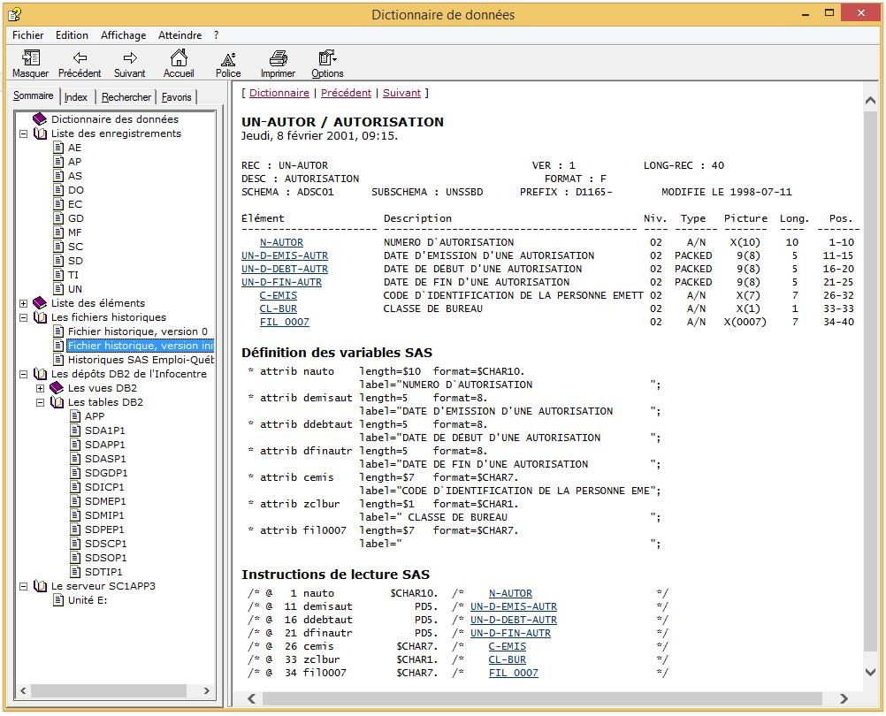

# Quelques-uns de mes projets

## Mes notes de cours avec Antora

`Antora` `AsciiDoc` `LaTeX` `VS Code`

Depuis 2020, je collige toutes mes notes de cours et de lecture dans [Antora](https://antora.org/) 
avec AsciiDoc et [LaTeX](https://www.latex-project.org/) sur [Visual Studio Code](https://code.visualstudio.com/).

## Udacity, Full Stack Web Developer Nanodegree

`HTML/CSS` `Python` `Flask` `SQLite` `Knockout.js` `Google Maps API` `Foursquare API` `Amazon Lightsail` `PostgreSQL`

En 2017, j'ai réalisé les travaux suivants dans le cadre du cours «&nbsp;Full Stack Web Developer Nanodegree&nbsp;» de Udacity.

- [Linux Server Configuration](https://github.com/boisalai/udacity-linux-server-configuration)
- [Neighborhood map](https://github.com/boisalai/udacity-neighborhood-map)
- [Catalog App](https://github.com/boisalai/udacity-catalog-app)
- [Logs Analysis Project](https://github.com/boisalai/udacity-logs-analysis-project)
- [Build a Portfolio Site](https://github.com/boisalai/udacity-portfolio-site)
- [Movie Trailer Website](https://github.com/boisalai/udacity-movie-trailer-website)

## Modèle de simulation du revenu disponible

`VBA/Excel` [`Docbook`](https://docbook.org/) `HTML Help`

Entre 2001 et 2006, j’ai développé un calculateur d’impôts sur le revenu et des transferts aux particuliers. Ce calculateur était développé en VBA/Excel et documenté dans un fichier CHM. Avec des milliers de paramètres (ex. taux d'imposition, seuil de réduction de la PSV, cotisation annuelle maximale à l'assurance-emploi), il calculait notamment les revenus disponibles après impôts et transferts aux particliers, les seuils d’imposition nulle, et les taux marginaux implicites d’imposition, pour plusieurs types de ménages, provinces canadiennes et années d’imposition. Il produisait de nombreux tableaux et graphiques. Cet outil était grandement utilisé pour simuler des changements aux règles de calcul des impôts et crédits sociofiscaux, et pour produire des cas types.

## Entrepôt de données SAS

`SAS` `SAS Macro`

Entre 1992 et 2001, j’étais responsable de produire des informations de gestion sur les prestataires de l’aide sociale. J’ai développé de nombreux outils SAS pour faciliter l’exploitation des données, dont un entrepôt de données SAS et une macro `%histo` pour faciliter l'extraction de données de l'entrepôt sur disque et de données stockées sur rubans magnétiques.

## Dictionnaire de données

`JCL/OS` `SAS` `Docbook` `HTML Help`

Entre 1992 et 2001, j’ai développé un dictionnaire de données à partir de plusieurs sources (IDMS, DB2, SAS, fichiers plats sur rubans magnétiques) contenant environ 21 500 rubriques et 316 000 liens hypertextes. Tous les fichiers étaient construits en SAS sur un ordinateur central. Il ne restait plus qu'à télécharger et compiler avec [HTML Help Workshop](https://docs.microsoft.com/en-us/previous-versions/windows/desktop/htmlhelp/microsoft-html-help-downloads).

